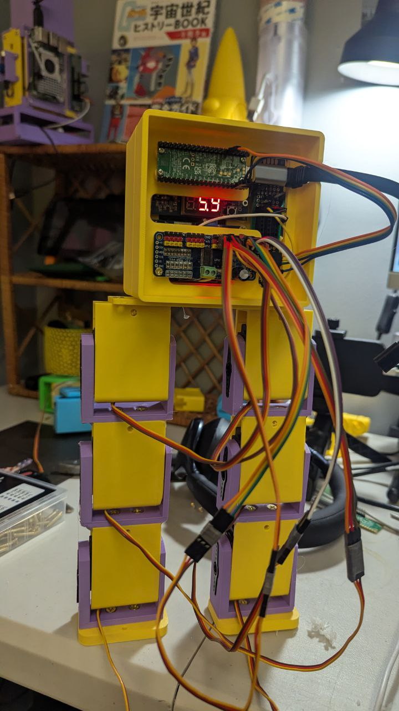
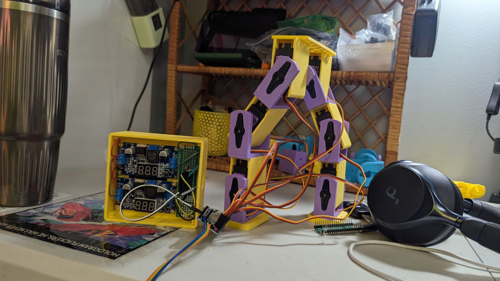
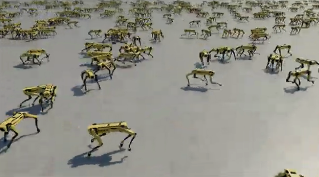

# Goal

Build and train a bipedal walking robot to walk on a flat surface.

# Specifications

The model is meant to run on Raspberry Pi Pico.

The model is trained on GTX 4090.

Components:
- Raspberry Pi Pico
- 6 servo motors MG996R
- IMU sensor
- 6 18650 cells
- Adafruit PCA9685 16-Channel PWM/Servo Driver

For the 2 legs of the robot, from top down, each servo are connected to 0,1,2 & 4,5,6 on the PCA9685.

# Milestone 1

[x] Build the robot v1. See robot photo on  

# Milestone 2

[ ] Train the robot to walk on a flat surface through a simulation, similar to Isaac Sim, where we have many versions of the robot walk and fail and update the weight and keep going like . Because we have a small model enough (to run on Pico), using gtx 4090 we can train many versions of the model at the same time. Think Reinforcement Learning + Evolutionary Algorithm.

Specification:

- All code in train/ folder
- Always use train/venv/ as virtual env
- Always use requirements.txt to install packages
- I want to have a simple web interface to view the robot training process in realtime, on port 1306. This will be viewed from a browser on a different computer. Refer to reference/ for reference.